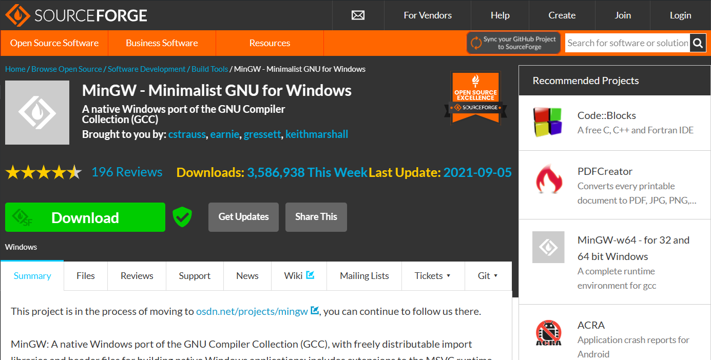
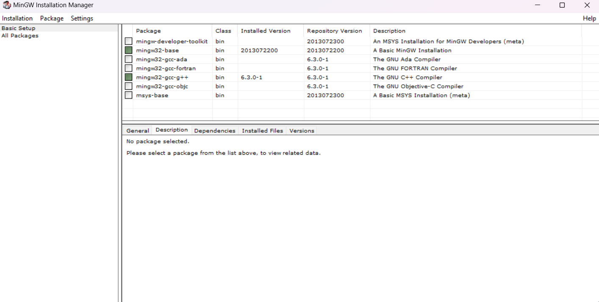

# Learn C++

### Introduction

***


C++ is a very popular **programming language**.<br/>
C++ can be used to create **high-performance** applications.<br/>
C++ is a **cross-platform language**.
C++ was developed by **Bjarne Stroustrup** in 1979.<br/>

C++ gives programmers a high level of control over system resources and memory.<br/>
The language was updated 4 major times in 2011, 2014, 2017 and 2020 to `C++11`, `C++14`, `C++17`, `C++20`.

### Why use C++?

- C++ is one of the world's most popular programming language.
- C++ can be found in today's `Operating systems`, `Graphical User Interfaces`, and `Embedded systems`.
- C++ is an `Object-Oriented` Programming language which gives a clear structure to programs and allows code to be reused, lowering development costs.
- C++ is portable and can be used to develop applications that can be adapted to mutliple platforms.

> [!IMPORTANT]\
> **Difference between C and C++**
>
> C++ was developed as an extension of C, and both language have almost the same syntax.<br/>
> The main difference between C and C++ is that C++ support `classes` and `objects`, while C does not.

## Getting Started 🚀
To start coding with C++, we need two things:
- A text editor like `Visual Studio Code`, `code::block`
- A compiler like `GCC` with `MingW`

### Setup MingW in machine
**Open any browser and search for `MingW download`**


**Download the `mingW` setup from the official site and install**


> [!NOTE]\
> Don't touch directory options let it be default

**After installation tick packages**


Make sure you have selected `mingW32-base` and `mingW32-gcc-g++` 

Apply changes from Installation

> [!IMPORTANT]\
> **Set path variable**\
> Search in your machine for `system variable`\
> Update `user variable` --> `path`\
> Add a new path for `bin` directory which is inside `MingW` and paste it in path variable.
> ```
> C:\MinGW\bin
> ```

### To check MingW environment working or not!
Open bash and run the commands 
```bash
gcc --version

g++ --version
```

***
### Create first C++ program
In VS code create a file with name as `firstprogram.cpp`
```cpp
#include<iostream>                      // Header file
using namespace std;                    // Standard library

int main(){
    cout << "Hello World!";             // Code for print message
    return 0;
}
```

For running the code open terminal window in VS Code and run the command
```bash
g++ firstprogram.cpp
```
It will create a new file as `a.exe`<br/>
This `a.exe` file contains the actual program we have written.<br/>
For running this file use the command line as
```bash
.\a.exe
```
Or `a` + `tab` it will auto complete.

**Don't Worry**! 😀<br/>
*We are not going to use this method instead we will use a code runner extension.*

And press the `play button` at the top right corner of the window.

> [!NOTE]\
> When we use `code runner` extension for running our code.\
> It uses output window for printing results.\
> Where we cannot interact I mean cannot input any value.
>
> **Here is a solution for it.**\
> Run your code using `code runner`\
> Open terminal window in vs code and type the name of the file which is generated by code runner.\
> `firstprogram.exe`
>
> **Congrats! 🎉**\
> You have learnt the basic Installation process and code running process.

#### Happy Coding! 💖